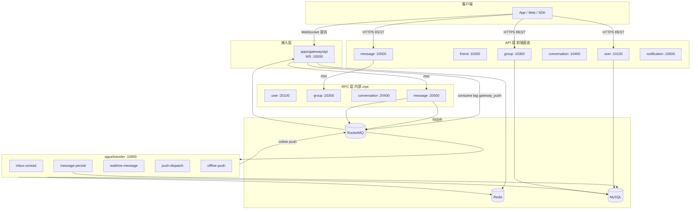
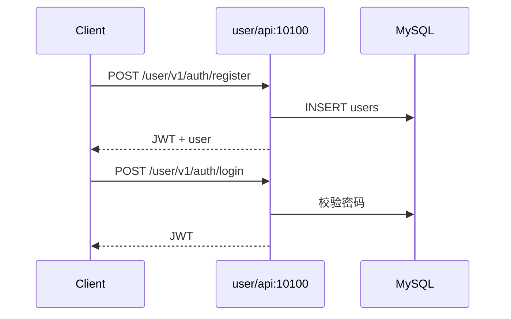
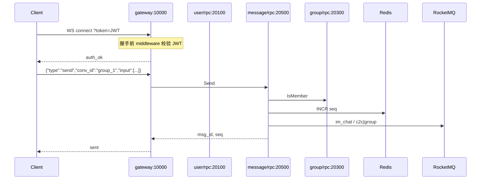
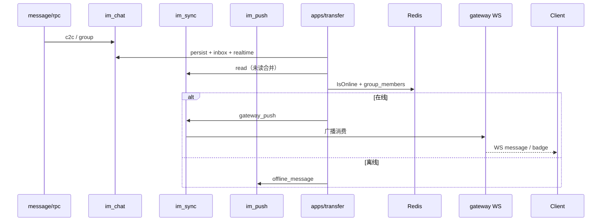
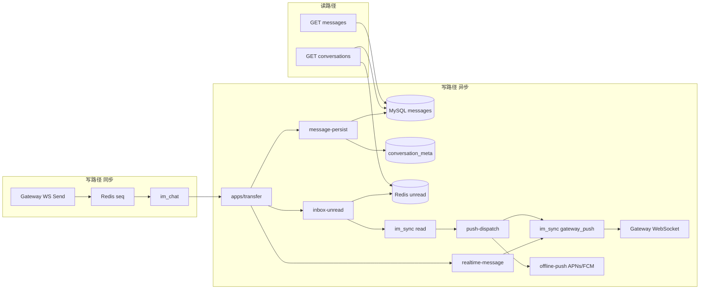
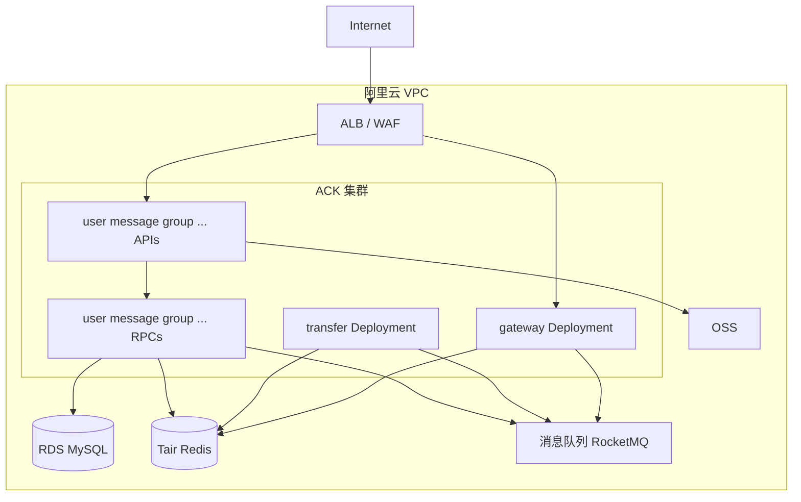

# IM Platform — 万人群即时通讯后端

基于 **go-zero** 的万人群 IM 微服务：各业务域位于 [`apps/`](apps/)，共享库在 [`pkg/`](pkg/)，**RocketMQ** 按主业务拆分 Topic（`im_chat` / `im_push` / `im_sync`）+ **Tag** 订阅与路由，**WebSocket 统一实时推送**（新消息、红点、系统通知）。

**前端对接**（协议、REST、WS、`input` 消息体）：详见 [**docs/frontend-integration.md**](docs/frontend-integration.md)。

---

## 目录结构

```
im/
├── apps/                    # 所有业务微服务（go-zero api + rpc）
│   ├── gateway/api/         # WebSocket 网关 :10000（订阅 RocketMQ gateway_push 下行）
│   ├── user/                # 10100 / 20100
│   ├── friend/              # 10200 / 20200
│   ├── group/               # 10300 / 20300
│   ├── conversation/        # 10400 / 20400
│   ├── message/             # 10500 / 20500
│   ├── notification/        # 10600 / 20600
│   └── transfer/            # 10800  RocketMQ 异步任务（无 RPC）
├── pkg/                     # events、rocketmq、redis、repo、msgcore
├── migrations/              # MySQL 初始化（001 建表；004 旧库迁 input）
├── docs/                    # 前端对接文档 frontend-integration.md
├── deploy/k8s/              # K8s 清单（overlays/local、kind）
├── deploy/Dockerfile.*      # 容器镜像构建（供 K8s 使用）
└── scripts/                 # 启动、压测、goctl 生成
```

---

## 一、服务架构

### 1.1 设计原则

| 原则 | 说明 |
|------|------|
| 前后端分离接入 | 前端 **REST 直连各域 API** 做查询/管理；**发消息仅 WebSocket** |
| Gateway 实时通道 | **:10000** WebSocket：握手 JWT 鉴权、心跳、发消息；**订阅 Tag `gateway_push` 下行** |
| 服务间走 RPC | Gateway、Message 等通过 **zrpc** 调各域 **RPC**（20100–20600） |
| 写路径异步 | 发消息写 `im_chat`（按单聊/群聊等 Tag）；落库、未读、推送由 **transfer** 跨 Topic 消费 |
| 在线判定 | Redis `online:{uid}`（WS 鉴权写入）；在线下行走 `im_sync` / `gateway_push` |
| 万人群防风暴 | 未读 **Redis 批处理 + `im_sync` / `read` 合并**；实时消息推 **在线** 群成员（`online:{uid}`） |

### 1.2 端口规划

| 模块 | API（前端） | RPC（内部） | 职责 |
|------|-------------|-------------|------|
| gateway | **10000** | — | WebSocket `/gateway/v1/ws` + RocketMQ 广播消费下行 |
| user | 10100 | 20100 | 注册登录、资料、设备 Token、HTTP 在线心跳 |
| friend | 10200 | 20200 | 好友、接受好友建单聊 |
| group | 10300 | 20300 | 群 CRUD、成员、`IsMember` |
| conversation | 10400 | 20400 | 会话列表、已读、`EnsureDirect` |
| message | 10500 | 20500 | **仅查询**历史；发消息走 Gateway WS → RPC |
| notification | 10600 | 20600 | 系统通知 |
| **transfer** | **10800**（`/health`） | — | RocketMQ 异步任务（见 [`apps/transfer`](apps/transfer)） |

规则：**API `10XYZ` ↔ RPC `20XYZ`**；**transfer** 无 RPC，仅健康检查端口 `10800`。

### 1.3 服务架构图



### 1.4 单域分层（go-zero）

每个 `apps/<domain>/` 内：

```
api/   # rest 对外：handler → logic → repo
rpc/   # zrpc 对内：server → logic → repo
```

共享数据访问：[`pkg/repo`](pkg/repo)；发消息核心：[`pkg/msgcore`](pkg/msgcore)（**仅 message/rpc**，由 Gateway WebSocket 调用）。

---

## 二、架构流程图

### 2.1 用户注册与登录



### 2.2 WebSocket 发消息（Gateway → RPC）



### 2.3 万人群未读与红点（异步）



---

## 三、数据流转图

### 3.1 总览



### 3.2 RocketMQ Topic 与 Tag

按主业务拆分为三个 Topic；**Tag** 做订阅过滤与路由（Message Key：`conv_id` 或 `user_id` 保序）。

#### 服务端统一排序（bizSeq）

1. **Gateway** 按 `conv_id` 聚合 **500ms** 滑动窗口；窗口内按客户端 `send_ts` 升序规整。
2. 按规整顺序，用服务端接收时间 `server_recv_ms` 计算时间片：`timeSlot = server_recv_ms / 500`。
3. Redis `im:seq:slot:{sessionId}:{timeSlot}` INCR 得 `slotOffset`（1分钟 过期）。
4. `bizSeq = (timeSlot << 16) | slotOffset`，写入事件 `seq` / `biz_seq`。
5. **im_chat**（扇出）与 **im_chat_persist**（异步落库）均以 `sessionId` 为 Message Key，保证同会话有序。

客户端上行示例（仅 `input`，无顶层 `msg_type`/`content`）：

```json
{
  "type": "send",
  "conv_id": "c2c_1_2",
  "send_ts": 1715000000123,
  "input": [{ "msgType": "text", "content": "{\"text\":\"你好\"}" }]
}
```

完整字段与片段类型见 [**docs/frontend-integration.md**](docs/frontend-integration.md)。

#### `im_chat` — 聊天主消息

| Tag | 说明 | 生产者 | 消费者（Group） |
|-----|------|--------|-----------------|
| `c2c` | 单聊消息 | message/rpc | message-persist, inbox-unread, realtime-message |
| `group` | 群聊消息 | message/rpc | 同上 |
| `custom` | `input` 中含 `msgType=custom` 或 `custom_*` | message/rpc | 同上 |
| `recall` | 撤回（`input` 中含 `msgType=recall`，预留） | message/rpc | 同上（预留） |
| `persisted` | 落库完成 | transfer/message-persist（落库后可选广播） | （审计/搜索扩展） |

消费订阅表达式：`c2c || group || custom || recall`（**不含落库**，落库见 `im_chat_persist`）

#### `im_chat_persist` — 异步落库

| Tag | 说明 | 生产者 | 消费者 |
|-----|------|--------|--------|
| `store` | 待落库消息 | message/rpc | message-persist |

#### `im_push` — 离线推送

| Tag | 说明 | 生产者 | 消费者（Group） |
|-----|------|--------|-----------------|
| `offline_message` | 离线消息（APNs/FCM） | push-dispatch, push-notification | offline-push |
| `system_announce` | 系统公告 | notification/rpc | push-notification |

#### `im_sync` — 状态同步

| Tag | 说明 | 生产者 | 消费者（Group） |
|-----|------|--------|-----------------|
| `read` | 已读/未读增量（原 inbox.updated） | transfer/inbox-unread | push-dispatch |
| `gateway_push` | 在线实时下行（message/badge/notification） | transfer（在线路径） | gateway（**广播**） |
| `online` | 上下线 | （预留） | （预留） |
| `friend` | 好友变更 | （预留） | （预留） |
| `group_member` | 群成员变更 | （预留） | （预留） |

### 3.3 Redis 关键 Key

| Key | 类型 | 用途 |
|-----|------|------|
| `conv:{conv_id}:seq` | string | 会话消息序号 |
| `unread:{uid}` | hash | field=conv_id，未读数 |
| `online:{uid}` | string+TTL | 是否在线（WS 连接/心跳续期） |
| `dedupe:{client_msg_id}` | string | 幂等 24h |

### 3.4 MySQL 核心表

见 [`migrations/001_init.sql`](migrations/001_init.sql)：`users`、`friendships`、`groups`、`group_members`、`conversations`、`messages`、`notifications` 等。**不使用外键**，引用关系由应用层维护；已有库若带外键可执行 [`migrations/003_drop_foreign_keys.sql`](migrations/003_drop_foreign_keys.sql)。

**`messages` 表**：仅存 **`input` JSON 列**（形如 `{"input":[{"msgType":"text","content":"..."}]}`），无 `msg_type` / `content` 列。从旧库升级执行 [`migrations/004_messages_drop_msg_type_content.sql`](migrations/004_messages_drop_msg_type_content.sql)。

---

## 四、使用文档

> **客户端开发**：请先阅读 [**docs/frontend-integration.md**](docs/frontend-integration.md)（鉴权、conv_id、`input` 消息体、WebSocket 上下行、REST 列表、联调示例）。

### 4.1 环境要求

- Go 1.22+
- **Docker**（仅用于 `make build-images` 构建镜像）
- **kubectl** + **kind**（本地 K8s 集群，与线上一致）
- （可选）`goctl` 1.9+：`go install github.com/zeromicro/go-zero/tools/goctl@latest`

```bash
brew install kind kubectl   # macOS 示例
```

### 4.2 本地 Kubernetes（默认）

基础设施与应用均在集群 `im-local` 内；镜像 `im/<域>/<服务>:dev`。

```bash
make image-base-build   # 首次：Go/Alpine 基础镜像
make up                 # 等同 make k8s-up：构建镜像 → kind → kubectl apply
make seed               # 灌测试数据
kubectl -n im-local get pods
make down               # 删除部署
```

| Make 目标 | 说明 |
|-----------|------|
| `make up` / `make k8s-up` | 一键部署（MySQL / Redis / RocketMQ + 全部微服务） |
| `make down` / `make k8s-down` | 删除 namespace 资源 |
| `make seed` / `make k8s-seed` | 集群内 TRUNCATE + 种子数据 + Redis FLUSHDB |
| `make image-base-build` | `im-go-base:deps` / `im-go-base:runtime` |
| `make build-images` | 构建全部 `im/*` 服务镜像 |
| `make k8s-etc` | 仅生成配置与 K8s 清单 |
| `make k8s-forward` | API 端口转发（非 kind 时） |
| `make k8s-logs` | 跟踪 gateway 日志 |

详见 [**K8s 部署指南**](deploy/k8s/DEPLOY.md)（含镜像、Dashboard、Ingress）与 [`deploy/k8s/README.md`](deploy/k8s/README.md)。清单按模块位于 `deploy/k8s/overlays/local/apps/<模块>/`。**Gateway 默认 2 副本**，`gateway_push` 使用 RocketMQ **广播消费** + Service 会话保持；**kind** 将 NodePort 映射到本机 `10000`、`10100` 等。

### 4.2.1 可选：本机进程调试

若需在 IDE 里跑 Go 进程，先 `make up`，另开终端：

```bash
make run-all             # 本机启动各 RPC/API（连 localhost:3306/6379/9876）
```

kind 集群已将 MySQL / Redis / RocketMQ NameServer **NodePort 映射到本机标准端口**（MySQL `3306`），与 `write-etc.sh` 配置一致。非 kind 集群再用 `make k8s-forward-infra` 做端口转发。

配置使用 `apps/*/etc/*.yaml`（`make k8s-etc` 会同步集群用配置到 `deploy/k8s/...`，本机 etc 用 `scripts/write-etc.sh` 生成）。

### 4.3 服务与健康检查

| 服务 | 地址 |
|------|------|
| Gateway | `ws://localhost:10000/gateway/v1/ws` |
| User API | `http://localhost:10100` |
| Message API | `http://localhost:10500` |
| Transfer（健康检查） | `http://localhost:10800/health` |

```bash
curl http://localhost:10000/gateway/v1/health
curl http://localhost:10800/health
```

### 4.4 API 示例

REST 路径规范：`http://<host>:<port>/{service}/v1/...`（例如 user 服务 `POST /user/v1/auth/login`）。  
WebSocket：`ws://<gateway-host>/gateway/v1/ws`。

| 服务 | 路径前缀 |
|------|----------|
| user | `/user/v1` |
| friend | `/friend/v1` |
| group | `/group/v1` |
| conversation | `/conversation/v1` |
| message | `/message/v1` |
| notification | `/notification/v1` |
| gateway | `/gateway/v1`（含 `/ws`、`/health`） |

**开发鉴权（推荐，需 `Auth.DevMode: true`）**

凭 `user_id` 签发 JWT，用户不存在则自动创建占位账号：

```bash
curl -s -X POST http://localhost:10100/user/v1/auth/dev-token \
  -H 'Content-Type: application/json' \
  -d '{"user_id":1}'
```

响应含 `token`，用于 `Authorization: Bearer <token>` 或 WebSocket `?token=`。

**注册**（可选，正式账号）

```bash
curl -s -X POST http://localhost:10100/user/v1/auth/register \
  -H 'Content-Type: application/json' \
  -d '{"username":"alice","password":"secret","nickname":"Alice"}'
```

**登录**：尚未实现，请使用 `dev-token`。

**重置本地测试数据**（`TRUNCATE` 全表 + 种子数据 + Redis 清空）：

```bash
./scripts/reset-dev-data.sh
```

种子含用户 `1/2/3`、群 `group_1`、私信 `c2c_1_2` / `c2c_1_3`；详见 [`scripts/dev_reset_seed.sql`](scripts/dev_reset_seed.sql)。

### 4.4 `conv_id`（会话 ID）

`conv_id` 是**全局唯一的会话标识**，同一会话内所有人使用同一个值。用于：

- WebSocket 发消息：`send.conv_id`
- 拉历史：`GET /message/v1/conversations/{conv_id}/messages`
- 已读：`POST /conversation/v1/conversations/{conv_id}/read`
- 未读 Redis、RocketMQ 消息事件等

与 REST 返回的 `type` 字段对应关系：

| 场景 | `type`（API） | `conv_id` 格式 | 说明 |
|------|---------------|----------------|------|
| 群聊 | `group` | `group_{group_id}` | 例：`group_5` 表示群 ID=5 |
| 单聊/私信 | `c2c` | `c2c_{小uid}_{大uid}` | 两个用户 ID **升序** 用下划线连接；例用户 1 和 5 → `c2c_1_5` |

**生成规则（客户端请勿手写错序）**

- 群：已知 `group_id` → `group_<id>`
- 私信：对端 `peer_uid` 与本人 `my_uid` → `c2c_<min(my,peer)>_<max(my,peer)>`

Go 辅助函数见 [`pkg/convid`](pkg/convid/convid.go)：`convid.Group(id)`、`convid.C2C(a, b)`。

**兼容**：服务端仍识别旧格式 `g_*` / `d_*`，但新数据与文档均以 `group_*` / `c2c_*` 为准。已有库可执行 [`migrations/002_conv_id_format.sql`](migrations/002_conv_id_format.sql) 迁移主键。

**历史消息（只读 REST）**

**会话列表**（`conversation-api` **10400**）

- **群**：返回用户加入的**全部**群（以 `group_members` 为准）
- **私信**：不要求好友；含非好友私信。默认返回全部私信，可在配置或 query 限制近 N 天（**N=0 表示全部**）

```bash
# 全部群 + 全部私信（默认 DirectRecentDays: 0）
curl -s http://localhost:10400/conversation/v1/conversations \
  -H "Authorization: Bearer $TOKEN"

# 仅近 30 天有活动的私信（群不受影响）
curl -s "http://localhost:10400/conversation/v1/conversations?direct_days=30" \
  -H "Authorization: Bearer $TOKEN"
```

配置 `apps/conversation/api/etc/conversation-api.yaml`：

```yaml
Conversation:
  DirectRecentDays: 0   # 0=全部私信；例如 7 表示默认只列近 7 天
```

发私信（`c2c_*`）时 message/rpc 会自动创建会话成员，**不要求好友**。

**历史消息**

```bash
curl -s "http://localhost:10500/message/v1/conversations/c2c_1_2/messages?limit=50" \
  -H "Authorization: Bearer $TOKEN"
```

**建群**

```bash
curl -s -X POST http://localhost:10300/group/v1/groups \
  -H "Authorization: Bearer $TOKEN" \
  -H 'Content-Type: application/json' \
  -d '{"name":"测试群","member_ids":[2,3]}'
```

### 4.5 WebSocket 协议（Gateway）

连接（**握手时携带 JWT**，无需 `auth` 帧）：

```
ws://localhost:10000/gateway/v1/ws?token=<JWT>
```

或请求头：`Authorization: Bearer <JWT>`

握手成功后服务端立即推送：`{"type":"auth_ok","user_id":123}`；token 无效则 HTTP `401`，不建立 WS。

**发消息**（唯一写入口，不经 Message API；消息体为 **`input` 数组**）：

```json
{
  "type": "send",
  "conv_id": "group_1",
  "client_msg_id": "optional-uuid",
  "send_ts": 1715000000123,
  "input": [
    { "msgType": "text", "content": "{\"text\":\"你好\"}" }
  ]
}
```

多段（图文混排）合并为**一条消息**，在 `input` 中按顺序放多个片段，见 [前端文档 §4](docs/frontend-integration.md#4-消息模型核心)。

成功：`{"type":"sent","msg_id":123,"seq":456}`

失败：`{"type":"error","code":"invalid_frame","msg":"..."}`

**心跳**（续期 Redis `online:{uid}`，避免误走 offline-push）：

- **服务端**：默认每 **60s** 续期 `online` 并发送 WebSocket 协议 `Ping`；**连续 3 次**未收到心跳响应（协议 `Pong` 或下方应用层 `ping`）则断开 WS。配置：`HeartbeatInterval`（秒）、`HeartbeatMaxMiss`（默认 3），建议间隔 `< OnlineTTL/2`。
- **客户端**：建议同样每 60s 发送应用层心跳：

```json
{"type":"ping"}
```

响应：`{"type":"pong"}`

**全局下行**：只要本机 WebSocket 已连接（`online:{uid}` 有效），所属群聊与单聊的新消息、`badge`、`notification` 均由服务端经 `im.gateway.push` 推送，**无需**按群 `subscribe`。

错误帧：`{"type":"error","code":"<slug>","msg":"..."}`。`code` 短码见 [`pkg/code`](pkg/code/)（整型分段与 API 端口对齐，如 gateway `10001+`、user `10101+`）。

### 4.6 WebSocket 服务端推送（下行）

transfer 判断用户在线后写入 `im.gateway.push`，Gateway 消费并推送到对应 WebSocket 连接。

| type | 说明 | 示例字段 |
|------|------|----------|
| `message` | 新消息 | `msg_id`, `conv_id`, `sender_id`, `seq`, **`input`**, `ts` |
| `badge` | 未读红点 | `conv_id`, `unread_delta`, `unread_total`, `seq`, `ts` |
| `notification` | 系统通知 | `title`, `body`, `category`, `ts` |

**新消息**示例：

```json
{
  "type": "message",
  "msg_id": 1001,
  "conv_id": "group_1",
  "conv_type": "group",
  "sender_id": 2,
  "seq": 88,
  "input": [
    { "msgType": "text", "content": "{\"text\":\"你好\"}" }
  ],
  "ts": 1715000000123
}
```

**红点**示例：

```json
{
  "type": "badge",
  "conv_id": "group_1",
  "conv_type": "group",
  "seq": 88,
  "unread_delta": 1,
  "unread_total": 5,
  "ts": 1715000000
}
```

### 4.7 环境变量

| 变量 | 默认值 | 说明 |
|------|--------|------|
| `MYSQL_DSN` | `im:im@tcp(localhost:3306)/im?parseTime=true&charset=utf8mb4&loc=Local` | 数据库 |
| `REDIS_ADDR` | `localhost:6379` | Redis |
| `ROCKETMQ_NAMESERVER` | `localhost:9876` | RocketMQ NameServer |
| `JWT_SECRET` | dev secret | 与各服务 yaml 中 `Auth.AccessSecret` 一致 |
| `GATEWAY_INSTANCE_ID` | hostname | Gateway 广播消费组标识（多副本可选区分） |
| `DEGRADE_OFFLINE_PUSH` | — | `1` 时跳过 APNs/FCM |
| `INBOX_MERGE_MS` | `100` | inbox 事件合并窗口 |
| `OFFLINE_MERGE_SEC` | `10` | 离线推送合并秒数 |

### 4.8 压测

```bash
make loadtest
# 或
go run ./scripts/loadtest -members 1000 -msgs 20
```

### 4.9 代码生成（goctl）

```bash
make gen    # 根据 apps/*/*.api 与 *.proto 生成骨架
```

注意：**不要**对已有 `logic/` 重复覆盖；仅在新接口时生成后手写 logic。

### 4.10 生产部署要点

- 各 RPC `etc/*.yaml` 将 `Endpoints` 改为 **etcd** 或 K8s DNS（如 `user-rpc:20100`）。
- 仅暴露：Gateway WS、各 API Ingress；**RPC 端口不对外**。
- JWT `AccessSecret` 使用密钥管理服务（阿里云 KMS）。
- 配置 `DEGRADE_*` 与 HPA，高峰时可关闭离线推送保核心链路。

---

## 五、阿里云部署组件与费用估算

以下为 **华东 1（杭州）** 量级参考（公开刊例价，实际以 [阿里云官网报价](https://www.aliyun.com/price) 及折扣为准；**未含**大促/合同价）。

### 5.1 推荐组件映射

| 本系统组件 | 阿里云产品 | 用途 |
|------------|------------|------|
| K8s 部署全部 `apps/*`（含 `transfer`） | **ACK**（容器服务 Kubernetes） | 微服务编排、HPA |
| 或裸机部署 | **ECS** + **SLB** | 替代 ACK 的轻量方案 |
| MySQL | **RDS MySQL** 高可用版 | 用户/群/会话元数据 |
| 消息表海量扩展 | **RDS 分库** 或 **Tablestore** / **Lindorm** | 消息历史（千万级以上建议独立） |
| Redis | **云数据库 Tair（Redis）** 集群版 | seq、未读、在线 |
| RocketMQ | **消息队列 RocketMQ 版** | `im_chat` / `im_push` / `im_sync` |
| 入口 | **ALB** / **SLB** + **WAF** | HTTPS API、**WebSocket** 长连接（:10000） |
| 静态/媒体 | **OSS** + **CDN** | 图片、文件（message 扩展） |
| 监控 | **ARMS** + **SLS** | 链路、日志、告警 |
| 注册发现（生产） | **MSE Nacos** 或 ACK 内置 | 替代直连 Endpoints |
| 密钥 | **KMS** | JWT、数据库密码 |
| 网络 | **VPC** + **NAT 网关** | 出网、跨 AZ |

### 5.2 三档容量与月费估算（人民币）

假设：**日活 10 万**，峰值在线 **1 万**，单群最大 **1 万** 人，峰值 **50 msg/s** 热点群。

#### 档 A — 开发 / 试点（本地 kind / 小规模 ACK）

| 组件 | 规格示例 | 月费约（元） |
|------|----------|-------------|
| ECS × 1 | 4C8G | 200–350 |
| RDS MySQL | 2C4G 基础 | 300–500 |
| Tair Redis | 1G 标准 | 100–200 |
| 消息队列 RocketMQ | 最低规格 | 400–600 |
| SLB | 按量 | 50–100 |
| **合计** | | **约 1,050–1,750 / 月** |

#### 档 B — 生产标准（推荐起步）

| 组件 | 规格示例 | 月费约（元） |
|------|----------|-------------|
| ACK 托管版 | 3 worker 节点 ecs.c6.xlarge | 2,500–4,000 |
| RDS MySQL | 4C16G 高可用 + 200G SSD | 1,200–2,000 |
| Tair Redis | 4G 集群（主从） | 600–1,200 |
| 消息队列 RocketMQ | 标准版 | 2,000–4,000 |
| **transfer + gateway** | ACK Deployment 各 2C4G ×2 | 含在 ACK 节点内 |
| ALB + WAF 基础 | 按量 + 基础防护（含 WS） | 500–1,500 |
| OSS + CDN | 500G 存储 + 流量 | 200–800 |
| ARMS + SLS | 按量 | 300–800 |
| NAT 网关 | 按量 | 200–500 |
| **合计** | | **约 8,300–16,300 / 月** |

#### 档 C — 万人群高可用 / 大规模

| 组件 | 规格示例 | 月费约（元） |
|------|----------|-------------|
| ACK | 6+ 节点、跨 AZ | 6,000–12,000 |
| RDS | 8C32G HA + 只读 + 1TB | 4,000–8,000 |
| 消息存储 | Tablestore / 分片 RDS | 2,000–6,000 |
| Tair | 16G+ 集群 | 2,000–5,000 |
| RocketMQ | 高吞吐、多副本 | 6,000–15,000 |
| Gateway 水平扩展 | 多副本 + 广播消费 gateway_push | 含在 ACK |
| ALB + WAF 高级 | WS 长连接 | 2,000–5,000 |
| CDN/OSS 流量加大 | | 1,000–5,000 |
| ARMS/SLS/KMS | | 1,000–3,000 |
| **合计** | | **约 27,000–67,000+ / 月** |

### 5.3 费用优化建议

1. **RocketMQ 与 inbox 消费**是万人群主要成本驱动；合理设置 `INBOX_MERGE_MS`、离线合并，减少 `inbox_updated` 条数。
2. **实时推送走 WebSocket**，transfer 仅对 `IsOnline` 用户发布 `gateway_push`，离线才走 APNs/FCM。
3. 消息表与元数据 **分库**：RDS 扛关系，海量消息用 Tablestore/OSS 冷存更省。
4. 使用 **预留实例 / 节省计划** 可降低 ECS、RDS、RocketMQ 约 30%–50%。
5. 非生产环境使用 **按量 + 夜间缩容**（ACK HPA min=0 需谨慎用于 RPC）。

### 5.4 ACK 部署示意



---

## 六、常见问题

**Q：为什么 API 和 RPC 分开？**  
A：API 面向公网 REST，RPC 面向内网高性能调用；Gateway 与 message 服务仅调 RPC，避免 HTTP 反代开销。

**Q：前端该连 Gateway 还是各 API？**  
A：REST 用于注册、会话列表、**拉历史消息**等查询；**发消息必须走 WebSocket（10000）**，下行推送（消息/红点/通知）也在同连接。协议细节见 [**docs/frontend-integration.md**](docs/frontend-integration.md)。

**Q：消息 JSON 怎么组？**  
A：上行/下行均使用 `input: [{ msgType, content }]`；`content` 为各类型 JSON 字符串（如 text 为 `{"text":"..."}`）。不要传顶层 `msg_type`/`content`。

**Q：本地 RPC 如何发现？**  
A：各服务 `etc/*.yaml` 中 `Endpoints: [127.0.0.1:20xxx]`；生产改为 etcd / K8s Service。

**Q：如何扩展单群 1 万人以上？**  
A：调大 `inbox-unread` 批大小与 Consumer 实例；RocketMQ 以 `conv_id` 为 Message Key 保证有序；必要时热点群使用独立 Tag 或 Topic 分片。

---

## 七、相关命令速查

```bash
make up          # Docker 依赖
make build       # 编译全部
make run-all     # 启动（见 scripts/run-local.sh）
make test        # 单元测试
make down        # 停止 Docker
```

更多服务说明见 [`apps/README.md`](apps/README.md)。
