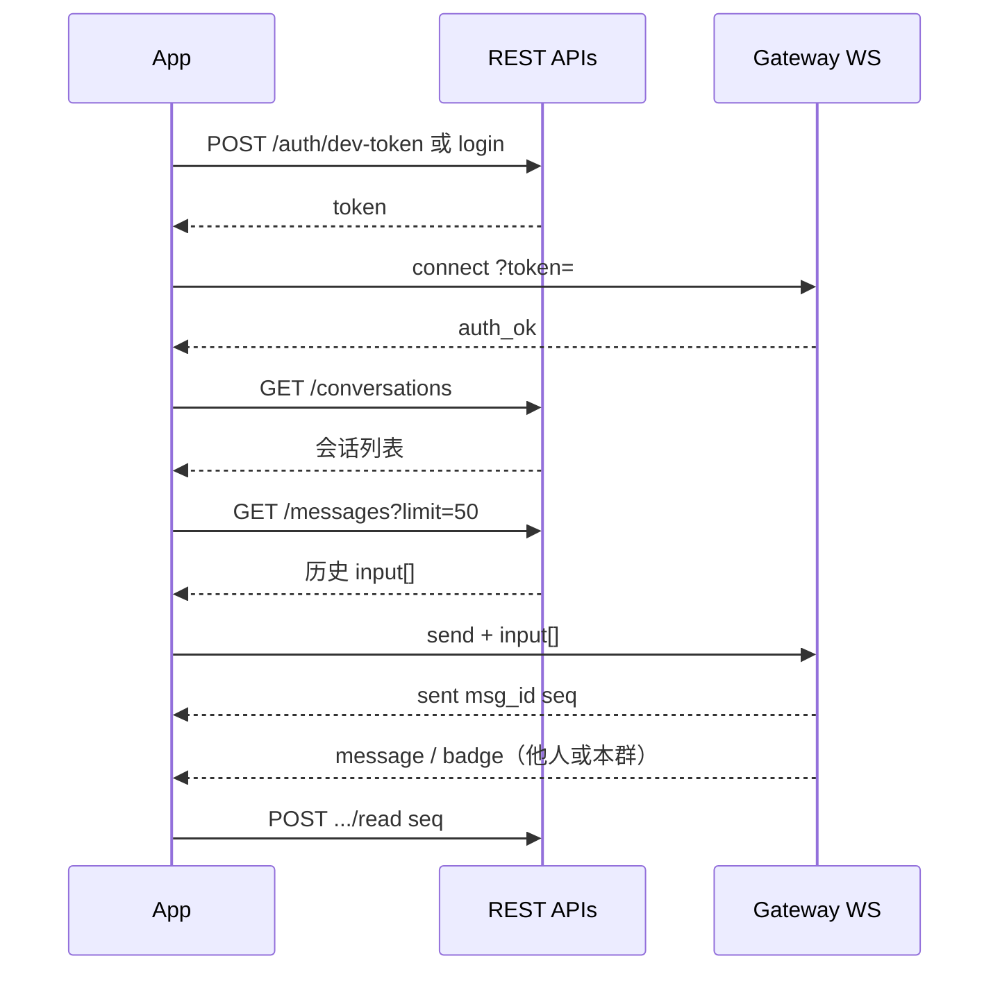

# IM 前端对接文档

本文档描述客户端（Web / App）与 IM 后端的对接约定：**查询走 REST**，**发消息与实时下行走 WebSocket**。协议与当前代码实现一致（MySQL、`messages.input` JSON 列）。

---

## 1. 架构与入口

| 能力 | 协议 | 基址（本地开发） |
|------|------|------------------|
| 登录 / 用户 / 好友 / 群 / 会话 | HTTPS REST | 见下表各 API 端口 |
| **发送聊天消息** | **WebSocket** | `ws://localhost:10000/gateway/v1/ws` |
| **新消息 / 红点 / 系统通知下行** | **同上 WebSocket** | 无需单独订阅 Topic |

| 服务 | 端口 | 前缀 |
|------|------|------|
| Gateway（WS） | 10000 | `/gateway/v1/ws` |
| User | 10100 | `/user/v1` |
| Friend | 10200 | `/friend/v1` |
| Group | 10300 | `/group/v1` |
| Conversation | 10400 | `/conversation/v1` |
| Message（只读历史） | 10500 | `/message/v1` |
| Notification | 10600 | `/notification/v1` |

生产环境将 host 换为网关域名；WebSocket 使用 `wss://`。

---

## 2. 鉴权

除注册、登录、开发 Token 外，REST 与 WS 均需 JWT。

### 2.1 获取 Token

**开发环境（推荐联调）**

```http
POST /user/v1/auth/dev-token
Content-Type: application/json

{"user_id": 1}
```

响应：

```json
{
  "token": "eyJhbGciOiJIUzI1NiIs...",
  "user_id": 1,
  "user": { "id": 1, "username": "dev_1", "nickname": "Dev 1", "avatar_url": "" }
}
```

**正式环境**

```http
POST /user/v1/auth/register
POST /user/v1/auth/login
```

### 2.2 REST 携带方式

```http
Authorization: Bearer <token>
```

### 2.3 WebSocket 携带方式

任选其一：

- Query：`ws://host/gateway/v1/ws?token=<JWT>`
- Header：`Authorization: Bearer <JWT>`

握手失败返回 HTTP `401`，不建立 WebSocket。成功后的首帧：

```json
{"type":"auth_ok","user_id":123}
```

---

## 3. 会话 ID（conv_id）

全局唯一字符串，发消息、拉历史、未读均使用同一 `conv_id`。

| 类型 | 格式 | 示例 |
|------|------|------|
| 单聊 | `c2c_{小uid}_{大uid}` | 用户 1 与 2 → `c2c_1_2` |
| 群聊 | `group_{group_id}` | 群 1 → `group_1` |

单聊 ID 由服务端按双方 uid **升序** 生成，前端应使用接口返回的 `conv_id`，不要自行拼接（除非与 `pkg/convid` 规则一致）。

建群接口返回 `conv_id`；接受好友返回 `conv_id`（可选，单聊发消息时服务端也会自动建会话）。

---

## 4. 消息模型（核心）

一条聊天消息在库表、REST、WebSocket 中统一为 **`input` 数组**：每个元素是一段可渲染内容（文本、图片、表情等），**多段合并为一条消息**。

### 4.1 结构定义

```ts
/** 单段消息体 */
interface MessageInput {
  /** 片段类型，决定如何解析 content */
  msgType: "text" | "image" | "emoji" | "custom" | string;
  /** 该类型的 JSON 字符串（不是对象，需 JSON.parse） */
  content: string;
}

/** 完整消息（REST 列表 / WS 下行） */
interface ChatMessage {
  id: number;
  conv_id: string;
  sender_id: number;
  seq: number;
  input: MessageInput[];
}

/** WebSocket 发消息上行帧 */
interface SendFrame {
  type: "send";
  conv_id: string;
  input: MessageInput[];
  client_msg_id?: string;  // 建议 UUID，幂等 24h
  send_ts?: number;        // 客户端发送时间，毫秒，用于同会话排序
}
```

**注意**

- 上行 **不要** 再传顶层 `msg_type`、`content`（已废弃）。
- 下行 `type: "message"` 帧同样使用 `input`，无 `msg_type` / `content` 字段。

### 4.2 各 msgType 的 content 格式

`content` 必须是 **合法 JSON 对象字符串**（服务端会校验并规范化）。

| msgType | content 示例（字符串内容） | 说明 |
|---------|---------------------------|------|
| `text` | `{"text":"你好"}` | `text` 不能为空 |
| `image` | `{"url":"https://cdn.example.com/a.png","width":800,"height":600}` | `url` 必填 |
| `emoji` | `{"emoji":"😀"}` | `emoji` 必填 |
| `custom` | `{"type":"card","data":{"order_id":"123"}}` | `type` 必填；`data` 可选 |

### 4.3 发送示例

**纯文本**

```json
{
  "type": "send",
  "conv_id": "c2c_1_2",
  "client_msg_id": "550e8400-e29b-41d4-a716-446655440000",
  "send_ts": 1715000000123,
  "input": [
    {
      "msgType": "text",
      "content": "{\"text\":\"你好\"}"
    }
  ]
}
```

**图文混排（一条消息）**

```json
{
  "type": "send",
  "conv_id": "group_1",
  "input": [
    {
      "msgType": "image",
      "content": "{\"url\":\"https://cdn.example.com/pic.png\"}"
    },
    {
      "msgType": "emoji",
      "content": "{\"emoji\":\"👍\"}"
    },
    {
      "msgType": "text",
      "content": "{\"text\":\"如图\"}"
    }
  ]
}
```

### 4.4 前端渲染建议

```ts
function parsePart(part: MessageInput) {
  const body = JSON.parse(part.content);
  switch (part.msgType) {
    case "text":
      return { kind: "text", text: body.text };
    case "image":
      return { kind: "image", url: body.url, width: body.width, height: body.height };
    case "emoji":
      return { kind: "emoji", emoji: body.emoji };
    case "custom":
      return { kind: "custom", type: body.type, data: body.data };
    default:
      return { kind: "unknown", raw: body };
  }
}

function renderMessage(msg: ChatMessage) {
  return msg.input.map(parsePart);
}
```

---

## 5. WebSocket 协议

### 5.1 帧类型一览

| 方向 | type | 说明 |
|------|------|------|
| 下行 | `auth_ok` | 连接成功 |
| 上行 | `send` | 发送消息 |
| 下行 | `sent` | 发送成功 |
| 上行/协议 | `ping` | 心跳（应用层或配合协议 Ping） |
| 下行 | `pong` | 心跳响应 |
| 下行 | `message` | 新消息推送 |
| 下行 | `badge` | 未读红点 |
| 下行 | `notification` | 系统通知 |
| 下行 | `error` | 错误 |

### 5.2 发送消息

**请求**

见 [4.3 发送示例](#43-发送示例)。

**成功响应**

```json
{
  "type": "sent",
  "msg_id": 1000123456789,
  "seq": 1715000000456
}
```

- `msg_id`：全局消息 ID（雪花）
- `seq`：会话内业务序号 `biz_seq`，同一会话内递增，用于排序与已读

**失败响应**

```json
{
  "type": "error",
  "code": "invalid_frame",
  "msg": "input[0]: unsupported msg_type: video"
}
```

| code（slug） | 含义 |
|--------------|------|
| `unauthorized` | Token 无效 |
| `not_authed` | 未鉴权（不应出现在已连接场景） |
| `invalid_frame` | JSON/字段/片段校验失败 |
| `send_failed` | 下游 RPC 或业务失败（非成员、重复等） |
| `message_too_large` | 帧过大 |

### 5.3 心跳

- 建议每 **60s** 发送：`{"type":"ping"}`，收到 `{"type":"pong"}`。
- 用于续期在线状态 `online:{uid}`，避免仅收下行导致 TTL 过期。
- 服务端可能发 WebSocket 协议级 Ping，客户端应回复 Pong。

### 5.4 下行：新消息 `message`

```json
{
  "type": "message",
  "msg_id": 1002,
  "conv_id": "group_1",
  "conv_type": "group",
  "sender_id": 2,
  "seq": 88,
  "client_msg_id": "550e8400-e29b-41d4-a716-446655440000",
  "input": [
    { "msgType": "text", "content": "{\"text\":\"大家好\"}" }
  ],
  "ts": 1715000000123
}
```

处理逻辑：

1. 按 `conv_id` 归入对应会话。
2. 用 `seq` 与本地列表去重、排序（建议以 `seq` 为准）。
3. 对 `input` 逐段 `JSON.parse(content)` 后渲染。

### 5.5 下行：红点 `badge`

```json
{
  "type": "badge",
  "conv_id": "group_1",
  "conv_type": "group",
  "seq": 88,
  "unread_delta": 1,
  "unread_total": 5,
  "ts": 1715000000123
}
```

- `unread_delta`：本事件增量
- `unread_total`：该用户全局未读合计（服务端计算后下发，以服务端为准）

收到 `message` 且当前不在该会话页时，可同时依赖 `badge` 更新 Tab 角标；进入会话后调用 [已读接口](#63-标记已读)。

### 5.6 下行：系统通知 `notification`

```json
{
  "type": "notification",
  "title": "系统公告",
  "body": "维护通知",
  "category": "system",
  "ts": 1715000000123
}
```

---

## 6. REST API 摘要

所有请求需 `Authorization: Bearer <token>`（登录类除外）。

### 6.1 用户

| 方法 | 路径 | 说明 |
|------|------|------|
| POST | `/user/v1/auth/dev-token` | 开发 Token |
| POST | `/user/v1/auth/login` | 登录 |
| GET | `/user/v1/users/me` | 当前用户 |

### 6.2 好友

| 方法 | 路径 | Body | 说明 |
|------|------|------|------|
| POST | `/friend/v1/friends/request` | `{"user_id":2}` | 发起申请 |
| POST | `/friend/v1/friends/accept` | `{"user_id":2}` | 接受；响应含 `conv_id` |
| GET | `/friend/v1/friends` | — | 好友列表 |

### 6.3 群

| 方法 | 路径 | 说明 |
|------|------|------|
| POST | `/group/v1/groups` | 建群 `{"name":"群名","member_ids":[2,3]}` → `group` + `conv_id` |
| GET | `/group/v1/groups/:id` | 群资料 |
| POST | `/group/v1/groups/:id/members` | 加人 `{"user_ids":[4,5]}` |
| GET | `/group/v1/groups/:id/members?cursor=0` | 成员分页 |

### 6.4 会话列表

```http
GET /conversation/v1/conversations
GET /conversation/v1/conversations?direct_days=30
```

响应片段：

```json
{
  "conversations": [
    {
      "id": "group_1",
      "type": "group",
      "group_id": 1,
      "group_name": "测试群",
      "last_seq": 2,
      "last_preview": "大家好",
      "unread": 0,
      "pinned": false,
      "muted": false
    },
    {
      "id": "c2c_1_2",
      "type": "c2c",
      "peer_user_id": 2,
      "last_seq": 1,
      "last_preview": "单聊你好",
      "unread": 1,
      "pinned": false,
      "muted": false
    }
  ]
}
```

`unread` 来自 Redis，与 WS `badge` 配合使用；进入会话后应调已读。

### 6.5 历史消息（只读）

```http
GET /message/v1/conversations/{conv_id}/messages?limit=50
GET /message/v1/conversations/{conv_id}/messages?before_seq=100&limit=50
```

响应：

```json
{
  "messages": [
    {
      "id": 2001,
      "conv_id": "c2c_1_2",
      "sender_id": 1,
      "seq": 1,
      "input": [
        { "msgType": "text", "content": "{\"text\":\"单聊你好\"}" }
      ]
    }
  ]
}
```

- 默认按 `seq` **升序**返回（服务端先查降序再反转）。
- 分页：取当前页最小 `seq` 作为下次 `before_seq`。

### 6.6 标记已读

```http
POST /conversation/v1/conversations/{conv_id}/read
Content-Type: application/json

{"seq": 88}
```

`seq` 为已读到的最大业务序号（含本条）。

---

## 7. 推荐客户端流程



### 7.1 连接与重连

1. 登录拿 `token`。
2. 建立 WebSocket，等待 `auth_ok`。
3. 拉会话列表 + 打开会话时拉历史。
4. 发送：组 `input` → `send`；本地可先插入「发送中」占位，收到 `sent` 后写入 `msg_id`/`seq`。
5. 断线重连：指数退避；重连后重新拉取活跃会话的 `before_seq` 之后消息，按 `seq` 去重。

### 7.2 幂等与排序

| 字段 | 建议 |
|------|------|
| `client_msg_id` | 每条待发消息生成 UUID；重试发同一帧，服务端 24h 去重 |
| `send_ts` | 毫秒时间戳；同会话多条并发时辅助服务端 500ms 窗口内排序 |
| `seq` | 展示与已读一律以服务端 `sent.seq` / 下行 `message.seq` 为准 |

### 7.3 本地开发联调

```bash
make up && make seed
```

种子用户：`user_id` 1 / 2 / 3；示例会话 `group_1`、`c2c_1_2`。

```bash
# Token
curl -s -X POST http://localhost:10100/user/v1/auth/dev-token \
  -H 'Content-Type: application/json' -d '{"user_id":1}'

# 历史
curl -s "http://localhost:10500/message/v1/conversations/group_1/messages?limit=20" \
  -H "Authorization: Bearer $TOKEN"
```

WebSocket 可用浏览器控制台或 `wscat`：

```bash
wscat -c "ws://localhost:10000/gateway/v1/ws?token=$TOKEN"
> {"type":"ping"}
> {"type":"send","conv_id":"group_1","input":[{"msgType":"text","content":"{\"text\":\"hi\"}"}]}
```

---

## 8. 类型扩展

服务端通过 `pkg/msghandler` 注册新 `msgType`。新增类型前需与后端约定 `content` JSON schema，并在网关配置中注册 Handler。

`custom` 及 `custom_*` 走独立 RocketMQ Tag，便于独立消费；前端按 `msgType` 与 `custom.type` 分支渲染即可。

---

## 9. 错误码参考

Gateway 段：`10001`–`10006`，JSON 中 `code` 为 slug 字符串（如 `invalid_frame`）。完整定义见 [`pkg/code`](../pkg/code/)。

---

## 10. 变更记录（与旧版差异）

| 项目 | 旧版 | 当前 |
|------|------|------|
| 数据库 | PostgreSQL | **MySQL 8** |
| 发消息字段 | 顶层 `content` + `msg_type` | 仅 **`input[]`** |
| 历史/下行 | `content` 字符串 | **`input[]`** |
| 图文混排 | 多条 WS 消息 | **单条消息多段 input** |

如有疑问请联系后端或查阅 [`README.md`](../README.md) 与源码 `apps/gateway/api/internal/protocol`。
